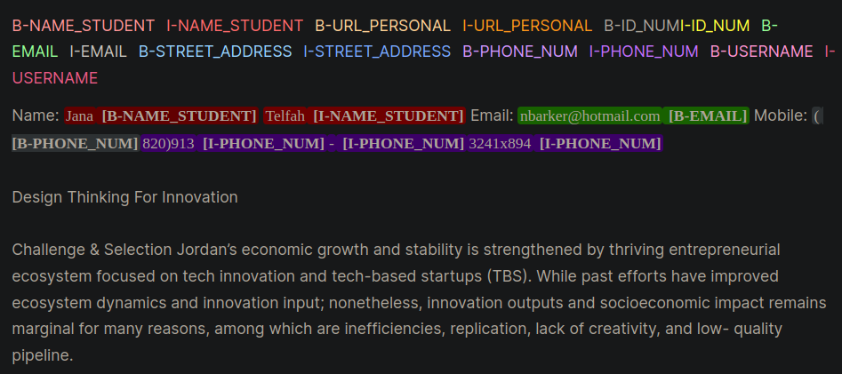

<h1 align="center">
  PII Detection and BIO Synthetic Data Generation
</h1>

<p align="center">This repository fine-tunes a state of the art PII detection system and enhances performance with synthetic PII data generation.
</p> 

<p align="center">
<a href="#introduction">Introduction</a> &nbsp;&bull;&nbsp;
<a href="#highlights">Highlights</a> &nbsp;&bull;&nbsp;
<a href="#synthetic-pii-data">Synthetic PII Data</a> &nbsp;&bull;&nbsp;
<a href="#pii-entity-detection-systems">PII Entity Detection Systems</a> &nbsp;&bull;&nbsp;
<a href="#issues">Issues</a> &nbsp;&bull;&nbsp;
</p>

<p align="center">
  <a target="_blank" href="https://www.linkedin.com/in/myles-dunlap/">
  </a>
  <a target="_blank" href="https://www.kaggle.com/dunlap0924">
  </a>
  <a target="_blank" href="https://scholar.google.com/citations?user=ZpHuEy4AAAAJ&hl=en">
  </a>
</p>

# Introduction
Personal identifiable information (PII) is sensitive data used to identify, locate, or contact an individual. PII entity detection systems can identify, categorize, and redact sensitive information in unstructured text. Improving PII detection systems help maintain the privacy and security of individuals, comply with legal and regulatory requirements, and prevent identity theft, fraud, or other types of harm. Figure 1 provides an example PII entities using inside, outside, beginning (IOB) format.

<p align="center"> 
    
    <br>
    Figure 1: Example of PII Data in IOB Format [<a href="https://www.kaggle.com/code/snassimr/pii-data-detection-eda">Source</a>].
</p>

The work in this repository was derived during the Kaggle competition [The Learning Agency Lab - PII Data Detection](https://www.kaggle.com/competitions/pii-detection-removal-from-educational-data). Using the techniques in this repository will provide solutions in the Top 1% for the competition.

# Highlights

1) [Synthetic PII datasets](#synthetic-pii-datasets) with BIO formatting.
    - [Meta-Llama3-8B-Instruct](https://huggingface.co/meta-llama/Meta-Llama-3-8B-Instruct) is used to generate synthetic essays.
    - Prompting best techniques from [Prompt Engineering](https://www.promptingguide.ai/) and using `PII PlaceHolders` instead of directly putting PII data into a prompt.
    - [Faker](https://faker.readthedocs.io/en/master/) to create custom PII data that is injected into unstructured text.
    - Decoupling LLM domain specific generate text with PII placeholder and Faker PII data is useful for efficient experimentation in creating synthetic PII datasets.
2) [PII Entity Detection Systems](#pii-entity-detection-systems)
    - [Masked Language Modeling (MLM) with Hugging Face Trainer for Domain Adaptation](./training/mlm-training.py)
    - [Hugging Face Token Classification](https://huggingface.co/docs/transformers/en/tasks/token_classification) end-to-end pipeline is built for fine-tuning a state-of-the-art model.
    - [microsoft/deberta-v3-large](https://huggingface.co/microsoft/deberta-v3-large) model is trained using a configuration files and Bash shells for versatile automation. 
    - [Weights and Biases for Experiment Tracking](https://wandb.ai/site/experiment-tracking)
    - [Class Weights with Custom Loss Function](https://discuss.huggingface.co/t/how-can-i-use-class-weights-when-training/1067) - token classification can have severe class imbalance and this is addressed by adjusting the `class_weights` parameter in the [Hugging Face Trainer](https://huggingface.co/docs/transformers/en/main_classes/trainer) and with a either a [Focal Loss](https://paperswithcode.com/method/focal-loss#:~:text=Focal%20loss%20applies%20a%20modulating,in%20the%20correct%20class%20increases.) or [Cross Entropy Loss](https://pytorch.org/docs/stable/generated/torch.nn.CrossEntropyLoss.html).

# Synthetic PII Data

The IOB format, also commonly referred to as the BIO format, is a common tagging format for tagging tokens in a chunking task such as Named Entity Recognition (NER) applications. Creating labeled BIO datasets can be time and labor intensive for domain specific datasets. An alternative approach is to synthetically generate PII datasets that closely represent your real-life application. Refer to the `gen-data` directory for code to create domain specific PII data. The below files would be executed sequentially because they each represent a different task in the synthetic PII data creation.

### 1) [Faker PII Data](./gen-data/pii-syn-data.py)
Synthetic PII data was created using [Faker](https://faker.readthedocs.io/en/master/) and custom functions to create PII information. This data was placed into LLM generated unstructured text that was created in the next step.


### 2) [LLM Domain Specific Text Generation](./gen-data/ai-gen-llama3.py)
 
Generative LLMs (e.g., Llama3) were used to generate unstructured text that resembles domain specific text. In this repository the data mimics essays from students in an online course. Refer to the various [prompts](./gen-data/prompt-templates/) for prompting examples used in this work.

**NOTICE**: a helpful insight learned during this work was to prompt the LLM to create `placeholders` for the PII data. The data from Step #1 will be injected into the placeholders. The PII placeholder approach provided the following anecdotal benefits:
  - Certain LLM models (both open and closed source) may refuse to generate text if PII is mentioned due to censorship.
  - Placeholders are easy to locate using simple techniques (e.g., regex).
  - LLM's hallucinated less when writing placeholders as opposed to PII data directly.

Two examples of prompting strategys are given which demonstrate the differences between prompting with PII directly (Example 1) and then with placeholders (Example 2). 

**Example 1: LLM Prompting with Direct PII Data Injection**
  ```txt
  Model Prompt:
  Write an sentence introducing yourself and include only your personal information provided below:
    - FULL_NAME: John Doe
    - PHONE_NUM: 555-123-4567

  Model Response:
  My name is John Doe and you can reach me at 555-125-4567 or by email at john.doe@gmail.com.
  ```
This prompting technique routinely introduced a few mistakes from the LLMs that were difficult to programmatically recognize and lead to mis-labeling of PII in the BIO format. Example 1 asks the model to directly insert PII data into the text and notice the few errors:
  - The PHONE_NUM was off by a single digit (123 vs. 125). This could occur with names, phone numbers, street address, or any of the PII entities.
  - The LLM would inject extra PII not asked for such as the `john.doe@gmail.com` email.
    
**Example 2: LLM Prompting with PII PlaceHolders**
  ```txt
  Model Prompt:
  Write an sentence introducing yourself and include only your personal information using the placeholders provided below:
    - {FULL_NAME}: First and Last Name
    - {PHONE_NUM}: Personal phone number

  Model Response:
  My name is {FULL_NAME} and you can reach me at {PHONE_NUM}.
  ```
  With Example 2 the LLM did not have the opportunity to transpose any errors in the PHONE_NUM or with the FULL_NAME. Also, it seemed the LLM would less frequently incorporate extra PII entities.


### 3) [Insert PII Data into LLM Generated Text](./gen-data/finalize-placeholder-data-llama3.py)
The above two steps decoupled PII data and domain specific text generation. In Step #3 the Step #1 PII data is inserted into Step #2's LLM domain specific generated text. This is useful because you can easily experiment with different combinations of PII data and domain specific text generation data.  

# PII Entity Detection Systems

The best performing LLM model for PII entity detection was Microsoft's [Decoding-enhanced BERT with Disentangled Attention V3](https://github.com/microsoft/DeBERTa) model. This model consistently performs well for encoder model tasks such as named entity recognition (NER), question and answer, and classification. 

A good starting point for training a Deberta-V3 model is with the [Baseline Deberta-V3 Fine-Tuning](./training/train_chunks_cib.py) module. In this module a custom Hugging Face Trainer was created to train with either Focal Loss or CE loss to account for class imbalance.

```python
class CustomTrainer(Trainer):
    def __init__(
            self,
            focal_loss_info: SimpleNamespace,
            *args,
            class_weights=None,
            **kwargs):
        super().__init__(*args, **kwargs)
        # Assuming class_weights is a Tensor of weights for each class
        self.class_weights = class_weights
        self.focal_loss_info = focal_loss_info

    def compute_loss(self, model, inputs, return_outputs=False):
        # Extract labels
        labels = inputs.pop("labels")

        # Forward pass
        outputs = model(**inputs)
        logits = outputs.logits

        # Loss calculation
        if self.focal_loss_info.apply:
            loss_fct = FocalLoss(alpha=5, gamma=2, reduction='mean')
            loss = loss_fct(logits.view(-1, self.model.config.num_labels),
                            labels.view(-1))
        else:
            loss_fct = CrossEntropyLoss(weight=self.class_weights)
            if self.label_smoother is not None and "labels" in inputs:
                loss = self.label_smoother(outputs, inputs)
            else:
                loss = loss_fct(logits.view(-1, self.model.config.num_labels),
                                labels.view(-1))
        return (loss, outputs) if return_outputs else loss
```

Further tricks and tips to help fine-tune PII detection systems that are contained in the [training](./training/) directory are:
  - [Masked Language Modeling (MLM) with Hugging Face Trainer for Domain Adaptation](./training/mlm-training.py) can utilize `unlabeled datasets` to expose a model to domain-specific language patterns and terminology. Fine-tuning a model that underwent additional pre-training on a specific task or domain, beginning with an initial checkpoint tailored for the task and data distribution at hand, typically yields better performance compared to fine-tuning models that start from a generic initial checkpoint [Sources: [1](https://www.kaggle.com/code/hinepo/domain-adaptation-with-mlm), [2](https://arxiv.org/abs/1905.05583)].
  - [Weights and Biases](https://wandb.ai/site/experiment-tracking) was used for experiment tracking in this source code. The below link is an excellent reference to follow on setting up W&B.
    - [Instrumenting Weights & Biases: PII data detection](https://www.youtube.com/watch?v=w4ZDwiSXMK0) Darek Kteczek shows how to instrument W&B in your ML pipelines using a PII detection use case
  - **Single or Dual GPU Training**: three modules were prepared to experiment with a fine-tuning model with single or dual GPUs. There was a balance between token lengths, model size, and training times.
    - [Single GPU for Reasonable Token Lengths with Stride](./training/train_chunks_cib.py): this is a typically fine-tuning approach where the token sizes of 512 or 1,024 with strides (e.g., 16, 32, or 128) are used to chunk the text. These approaches gave excellent results in performance and also do not require as much GPU memory. Recall, that GPU memory scales quadratically with token length for transformer models [[Latent Attention for Linear Time Transformers](https://arxiv.org/abs/2402].17512#:~:text=The%20time%20complexity%20of%20the,defining%20attention%20via%20latent%20vectors.).
    - [Single GPU using a High Token Length and No Stride](./training/train_single_large.py): [gradient check pointing](https://aman.ai/primers/ai/grad-accum-checkpoint/) was incorporated into this script to prevent GPU memory crashes due to very large token lengths > 5K.
    - [Dual GPU Training](./training/train_dual_gpu.py): this module shards the Deberta-V3 model across two GPUs so other memory efficient techniques do not need to be deployed and high token lengths can be utilized. A downside to this approach is that without proper hardware (i.e., [NVLinks](https://en.wikipedia.org/wiki/NVLink)) the training time will considerably increase due to data transfer between GPUs during training. 

**NOTE**: This workflow presented here can be adapted for many Hugging Face deep learning applications, not just LLMs.


# Issues
This repository is will do its best to be maintained. If you face any issue or want to make improvements please <a href="https://github.com/mddunlap924/PII-Detection/issues">raise an issue</a> or submit a Pull Request. :smiley:
